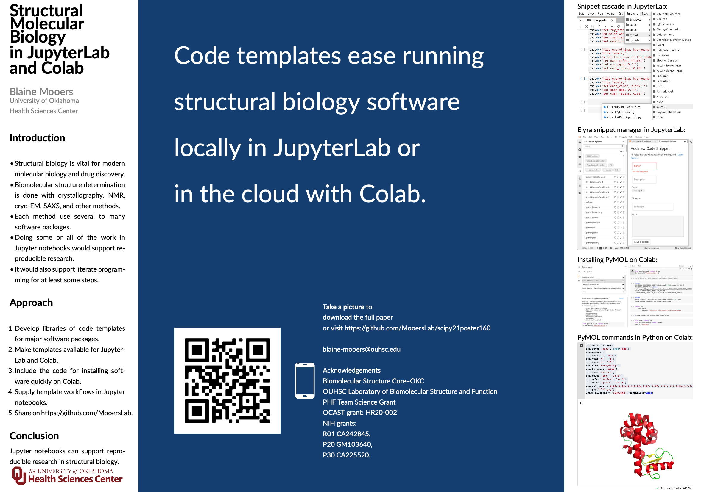

# scipy21poster160

This is the repository for SciPy21 poster 160 *Structural Molecular Biology in JupyterLab and Colab* by Blaine Mooers, OUHSC. The preview of the poster is shown below. Click on the icon of the PDF in the list of files above to view the poster on-line.
There will be a **download** button in the upper right above the poster for downloading the file. 

This site will eventually contain a link the related paper.

The repos mentioned in the paper are shown below.

| Repo name              | Decription                                               |
|:---------------------- | :------------------------------------------------------- |
|[pymolpysnips](https://github.com/MooersLab/pymolpysnips)             | Code templates for the molecular graphics program PyMOL. These are written in Python for use with the PyMOL Python API. |
